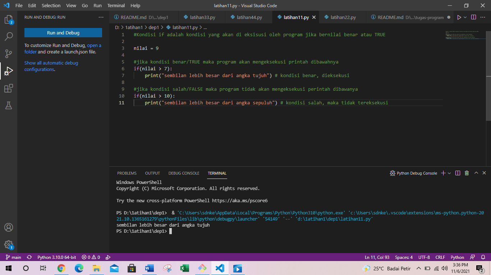
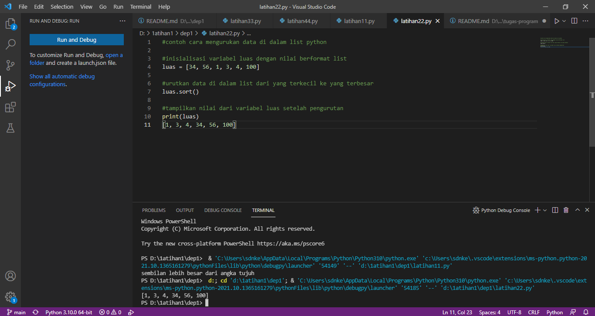

# dep1
## latihan pertama
### berikut beberapa program nya
1.program sederhana dengan input 2 buah bilangan, kemudian
tentukan bilangan terbesar dari kedua bilangan tersebut
menggunakan statement if.kita membuat nya dengan visual studio code dengan format file python seperti ini programnya.

2.program untuk mengurutkan data berdasarkan input sejumlah
data (minimal 3 variable input atau lebih), kemudian tampilkan
hasilnya secara berurutan mulai dari data terkecil.Sama seperti yang di atas kita membuat program dengan visual studio code atau juga bisa dengan pycharm,berikut program dan hasil nya

3.Buat program dengan perulangan bertingkat (nested) for yang
menghasilkan output sebagai berikut:1.2.3.4.5.6.7.8.9.10.11.12.13.14.15.16.17.18

4.Tampilkan n bilangan acak yang lebih kecil dari 0.5.
• nilai n diisi pada saat runtime
• anda bisa menggunakan kombinasi while dan for untuk
menyelesaikannya,berikut untuk program pembuatan dan hasil nya

